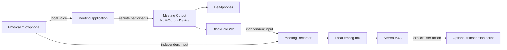

# Meeting Recorder Architecture

## Summary

Meeting Recorder replaces QuickTime's audio-only meeting capture workflow. It
opens the physical microphone and BlackHole 2ch as independent input-only
streams, writes temporary lossless captures, and combines them into a centered
stereo AAC M4A after recording stops.

The design deliberately avoids a `Microphone + BlackHole` aggregate input.
Testing showed that QuickTime could open the physical microphone directly while
a meeting was active, but opening the aggregate device stalled its meter until
Core Audio was restarted. Independent input capture avoids that failure.

## System diagram

## Capture behavior

- `External Microphone` is captured through its own `AVAudioEngine`.
- `BlackHole 2ch` is captured through a separate `AVAudioEngine`.
- Apple Voice Processing is enabled by default for the physical microphone.
- The user remains in control of Standard, Voice Isolation, or Wide Spectrum
  through Apple's system UI.
- The app never writes microphone samples into BlackHole, preventing meeting
  audio from being routed back to participants.
- On stop, ffmpeg converts the mono mic to centered stereo, preserves BlackHole
  stereo, mixes both sources, applies a safety limiter, and writes 48 kHz AAC.

## Validated workflow

The following path has been validated with a meeting running on two devices:

1. Meeting microphone set to `External Microphone`.
2. Meeting speaker set to `Meeting Output`.
3. Apple Voice Processing and Voice Isolation active.
4. Local microphone mute/unmute during recording.
5. Remote participant audio captured through BlackHole.
6. Stereo M4A produced without restarting Core Audio.
7. Post-record transcription and speaker diarization completed successfully.

## Known limitations

- Audio devices are currently located by fixed English display names.
- BlackHole and ffmpeg must be installed separately.
- Temporary source recordings are removed after a successful final mix. A
  failed mix leaves the temporary directory available for recovery.
- The menu reports recording state but does not yet show independent live level
  meters for local and remote sources.
- The selected transcription script is local user configuration and is not part
  of this repository.
- Ad-hoc builds can lose macOS privacy authorization after recompilation. Use a
  stable Apple Development or Developer ID identity for development/releases.
- Voice Processing support depends on the active microphone route; the active
  mode can differ from the user's preferred mode.

## Backlog

- Device picker and resilient device-UID persistence.
- Independent local/remote level indicators and stalled-flow detection.
- Recording elapsed time in the status menu.
- Configurable output format and mix levels.
- Optional source-separated sidecar tracks for diagnostics.
- Signed and notarized release packaging.
- Automated tests for M4A finalization and device-loss recovery.

Screen/video capture is intentionally out of scope for the current audio-only
application.
