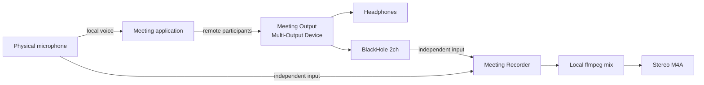

# Meeting Recorder Architecture

## Summary

Meeting Recorder replaces QuickTime's audio-only meeting capture workflow. It
opens the physical microphone and BlackHole 2ch as independent input-only
streams, writes temporary lossless captures, and combines them into a centered
stereo AAC M4A after recording stops.

The design deliberately avoids a `Microphone + BlackHole` aggregate input.
Testing showed that QuickTime could open the physical microphone directly while
a meeting was active, but opening the aggregate device stalled its meter until
Core Audio was restarted. Independent input capture avoids that failure.

## System diagram

## Capture behavior

- `External Microphone` is captured through its own `AVAudioEngine`.
- `BlackHole 2ch` is captured through a separate `AVAudioEngine`.
- Both devices are opened as plain input-only streams. The recorder does not
  enable Apple Voice Processing on its capture path, because Voice Processing
  is a full-duplex acoustic echo canceller that needs the speaker output as an
  echo reference. A capture-only recorder has no playback path, so without a
  reference the echo canceller cancels the microphone's own signal and deletes
  the local voice from the recording. Voice Isolation for the live call is
  owned by the meeting application and the system mic modes in Control Center.
- The app never writes microphone samples into BlackHole, preventing meeting
  audio from being routed back to participants.
- On stop, ffmpeg writes two AAC M4A files in one pass:
  - `<stem>.m4a`: a centered stereo mix (both voices in both ears) for playback.
  - `<stem>-sources.m4a`: a 2-channel file with the mic on the LEFT and the
    remote (BlackHole) on the RIGHT, so transcription can extract each side by
    channel — diarizing a summed mix is unreliable when speakers overlap, so the
    per-channel separation is the authoritative input for speaker-attributed
    transcription.

## Validated workflow

The following path has been validated with a meeting running on two devices:

1. Meeting microphone set to `External Microphone`.
2. Meeting speaker set to `Meeting Output`.
3. Local physical microphone and remote participant audio captured as
   independent raw streams.
4. Local microphone mute/unmute during recording.
5. Remote participant audio captured through BlackHole.
6. Stereo M4A produced without restarting Core Audio.

## Known limitations

- Audio devices are currently located by fixed English display names.
- BlackHole and ffmpeg must be installed separately.
- The recorder writes `<stem>.m4a` (centered, for playback) and
  `<stem>-sources.m4a` (L=mic/R=remote, for transcription). The temporary
  directory is removed after a successful encode. A failed encode leaves it for
  recovery.
- The menu reports recording state but does not yet show independent live level
  meters for local and remote sources.
- Ad-hoc builds can lose macOS privacy authorization after recompilation. Use a
  stable Apple Development or Developer ID identity for development/releases.
- Voice Processing is intentionally not used on the capture path; see
  “Capture behavior” above. Voice Isolation for the call is controlled from
  Control Center and is out of scope for the recorder.

## Backlog

- Device picker and resilient device-UID persistence.
- Independent local/remote level indicators and stalled-flow detection.
- Recording elapsed time in the status menu.
- Configurable output format and mix levels.
- Optional source-separated sidecar tracks for diagnostics.
- Signed and notarized release packaging.
- Automated tests for M4A finalization and device-loss recovery.

Screen/video capture is intentionally out of scope for the current audio-only
application.
