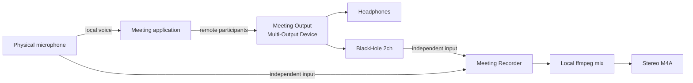

# Meeting Recorder Architecture

## Summary

Meeting Recorder replaces QuickTime's audio-only meeting capture workflow. It
opens the physical microphone and BlackHole 2ch as independent input-only
streams, writes temporary lossless captures, and encodes a centered stereo AAC
M4A plus a per-source (L=mic/R=remote) M4A after recording stops. It also
transcribes on-device: the "Transcribe Last Recording" menu action runs
FluidAudio (Parakeet ASR + offline VBx diarization) on the per-source file and
writes a speaker-attributed `<stem>.txt`.

The design deliberately avoids a `Microphone + BlackHole` aggregate input.
Testing showed that QuickTime could open the physical microphone directly while
a meeting was active, but opening the aggregate device stalled its meter until
Core Audio was restarted. Independent input capture avoids that failure.

## System diagram

## Capture behavior

- The chosen microphone (selectable via the Microphone menu; default
  `External Microphone`) is captured through its own `AVAudioEngine`.
- `BlackHole 2ch` is captured through a separate `AVAudioEngine`.
- Both devices are opened as plain input-only streams. The recorder does not
  enable Apple Voice Processing on its capture path, because Voice Processing
  is a full-duplex acoustic echo canceller that needs the speaker output as an
  echo reference. A capture-only recorder has no playback path, so without a
  reference the echo canceller cancels the microphone's own signal and deletes
  the local voice from the recording. Voice Isolation for the live call is
  owned by the meeting application and the system mic modes in Control Center.
- The app never writes microphone samples into BlackHole, preventing meeting
  audio from being routed back to participants.
- On stop, ffmpeg writes two AAC M4A files in one pass:
  - `<stem>.m4a`: a centered stereo mix (both voices in both ears) for playback.
  - `<stem>-sources.m4a`: a 2-channel file with the mic on the LEFT and the
    remote (BlackHole) on the RIGHT, so transcription can extract each side by
    channel — diarizing a summed mix is unreliable when speakers overlap, so the
    per-channel separation is the authoritative input for speaker-attributed
    transcription.

## Transcription

The **Transcribe Last Recording** menu action transcribes the most recent
recording on-device, in-process (no external script/Python). The **Transcribe…**
menu action opens a file picker to transcribe any `.m4a` file (not just the
last recording):

- Input: `<stem>-sources.m4a` (L = mic, R = remote); ffmpeg splits it into two
  16 kHz mono files.
- mic side → Parakeet ASR → labeled "You" (single speaker).
- remote side → offline VBx diarization (no speaker cap) + Parakeet ASR per
  segment → "Remote_A/B/…".
- Segments are merged by timestamp and written to `<stem>.txt`.

CLI: `nt <file.m4a>` transcribes any recording from the command line. `nt
<file.m4a> -o <out.txt>` specifies the output file. `nt` auto-builds
`experiments/native-transcriber` on first run and caches the binary.

Engine: [FluidAudio](https://github.com/FluidInference/FluidAudio) — NVIDIA
Parakeet TDT (CoreML/Apple Neural Engine) for ASR + an offline VBx (pyannote
segmentation + WeSpeaker + VBx clustering) diarizer. Models (~1 GB) download
from HuggingFace on first transcription and cache locally; inference is
on-device.

UI: the menu-bar icon animates with stationary fill-pulses — a slow pulse on
record.circle while recording and a faster pulse on text.bubble while
transcribing (monochrome, no rotation). The status line reports progress and
results — there are no success modals. "Transcribe Last Recording" is grayed
out until a recording exists (NSMenu.autoenablesItems is disabled so the manual
enabled state sticks). Sides or segments with no speech (e.g. a recording with
no remote party) are skipped rather than failing the transcription.

Diarizing the per-source channels (not the summed mix) is what makes labels
correct even when speakers overlap.

## Source layout

`src/MeetingRecorder/` — one file per concern:

- `RecorderError.swift` — error enum.
- `AudioDevices.swift` — Core Audio device lookup by name.
- `DeviceCapture.swift` — one `AVAudioEngine` per input device (raw, no Voice
  Processing). Includes an AUHAL (`kAudioUnitSubType_HALOutput`) capture path
  for Bluetooth headsets — bypasses `installTap` via `AURenderCallback`, avoids
  the AVAudioEngine aggregate that forces HFP mode. Key fix: must set
  `kAudioUnitProperty_StreamFormat` on `kAudioUnitScope_Output, 1`.
- `MeetingRecorder.swift` — owns both captures + the ffmpeg encode (centered
  M4A + `-sources.m4a`).
- `Transcriber.swift` — FluidAudio per-source transcription (Parakeet + offline
  VBx).
- `StatusIconAnimator.swift` — menu-bar icon pulse animation.
- `AppDelegate.swift` — menu-bar UI + record/transcribe actions.
- `main.swift` — entry point (`NSApplication.shared` + `run`).

`experiments/native-transcriber/` — a standalone Swift CLI testbed for the same
FluidAudio transcription (used to validate per-source diarization; the app
supersedes it for production use).

`experiments/audio-unit-capture/` — a standalone AUHAL capture experiment that
proved AudioUnit direct capture works with Bluetooth headsets and BlackHole.
Key findings: no `installTap` crash, `AudioUnitRender` returns `noErr`, and the
output-scope `StreamFormat` fix prevents `-50` paramErr.

Build: `Package.swift` (Swift Package Manager, depends on FluidAudio);
`./build-meeting-recorder.sh` builds + signs `out/Meeting Recorder.app`. Install
by copying the `.app` to `~/Applications`.

## Validated workflow

The following path has been validated with a meeting running on two devices:

1. Meeting microphone set to `External Microphone`.
2. Meeting speaker set to `Meeting Output`.
3. Local physical microphone and remote participant audio captured as
   independent raw streams.
4. Local microphone mute/unmute during recording.
5. Remote participant audio captured through BlackHole.
6. Centered M4A + per-source M4A produced without restarting Core Audio.
7. In-app transcription (Parakeet + VBx on the per-source file) → correct
   You/Remote labels, including overlapping speech.

## Known limitations

- Bluetooth headsets switch to HFP mode (16 kHz mono) during recording — this
  is a Bluetooth protocol limitation, not an app issue. A2DP (48 kHz stereo)
  resumes automatically when recording stops. The mic picker labels Bluetooth
  devices as "(Bluetooth — AUHAL)". Bluetooth capture uses AUHAL
  (`kAudioUnitSubType_HALOutput`) for both mic and meeting (BlackHole) to avoid
  AVAudioEngine's aggregate device, which would keep HFP active after stop.
- BlackHole and ffmpeg must be installed separately.
- The recorder writes `<stem>.m4a` (centered, for playback) and
  `<stem>-sources.m4a` (L=mic/R=remote, for transcription). The temporary
  directory is removed after a successful encode. A failed encode leaves it for
  recovery.
- First transcription downloads ~1 GB of FluidAudio models from HuggingFace
  (cached thereafter); inference is on-device on the Neural Engine.
- The menu reports recording state but does not yet show independent live level
  meters for local and remote sources.
- Ad-hoc builds can lose macOS privacy authorization after recompilation. Use a
  stable Apple Development or Developer ID identity for development/releases.
- Voice Processing is intentionally not used on the capture path; see
  “Capture behavior” above. Voice Isolation for the call is controlled from
  Control Center and is out of scope for the recorder.

## Backlog

- Resilient device-UID persistence (survive device re-enumeration).
- Independent local/remote level indicators and stalled-flow detection.
- Recording elapsed time in the status menu.
- Configurable output format and mix levels.
- Optional source-separated sidecar tracks for diagnostics.
- Signed and notarized release packaging.
- Multi-party (4+) diarization validation; Sortformer/LS-EEND engine options.
- Optional live transcription preview (streaming ASR + diarization).
- Automated tests: none yet. The app is GUI / Core Audio / FluidAudio, so
  verification is build + manual test; unit tests would require mocking
  AVAudioEngine / Core Audio / FluidAudio. Priorities when added: M4A
  finalization and device-loss recovery.

Screen/video capture is intentionally out of scope for the current audio-only
application.
